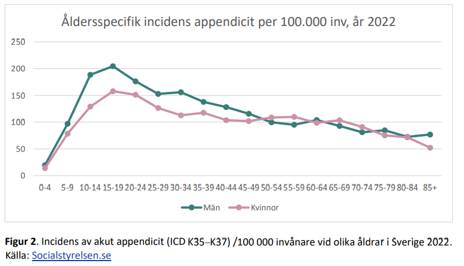
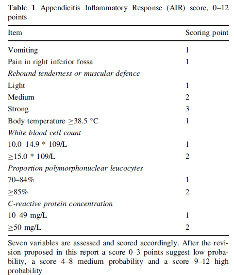
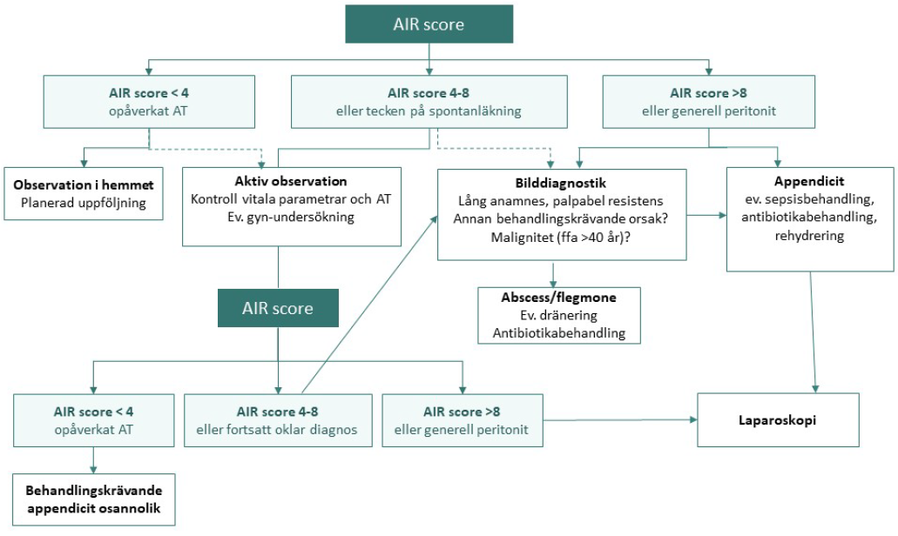

# Appendicit 

## <gr> Epidemiologi </gr>

| <bl> Sjukdom  </bl>          | <bl> Incidens / 100 000 </bl>   |    <bl> Fall / år </bl>     |
| -------------                 | :-----------:                   |     :---------------:       |
| <ye> **Appendicit** </ye>     | <ye> **120** </ye>              |   <ye>  **11 000**   </ye>  |
| Influensa (jämförelse)        | 5000                            |     500 000                 |

## <gr> Undersökningar </gr>

### <ye> Anamnes </ye>

|  Undersökning             | LR +                       | LR -                          |
| -------------             | :--------------------:     |    :--------------------:     |
| Smärtvandring till RLQ    |  2                         |    0.52                           |
| Historik av Feber         |    1.64                    |    0.61                           |
| Vomitus                   |    1.63                    |    0.75                           |
| Manligt kön               |    1.62                    |    0.62                           |
| Duration > 48h            |    0.49                    |    1.20                           |

::: details Källa 
_Artikel av Roland Andersson et al, "Meta-analysis of the clinical and laboratory diagnosis of appendicitis, 2003."_
:::

### <ye> Status </ye>

::: danger Stor variation av resultat förekommer mellan studier som forskat om bedside kliniska undersökningar. Eftersom det är personberoende och subjektivt förekommer stor variation i hur man undersöker och de slutsatser man drar. Här presenteras ett komposit från en betrodd källa.
:::

|  Undersökning              | Sensitivitet (%)          | Specificitet (%)          | LR +                         | LR -                          |
| -------------              | :-----------              | :--------------------     | :--------------------:       |    :--------------------:     |
| Mcburney point tenderness  | 72 (50-94)                | 80 (75-86)                |    3.4                       |        0.4                    |
| Rovsing sign               | 38 (7-68 )                | 77 (58-96)                |    2.1                       |        0.8                    | 
| RLQ tenderness             | 81 (65-100)               | 46% (1-92)                |    1.9                       |        0.3                    |
| Psoas (_alt Cope's_) sign  | 28 (13-42)                | 88 (79-97)                |    1.7                       |       Icke signifikant        |
| Obturator sign             | 18 (8-28)                 | 88 (81-94)                |       Icke signifikant       |      Icke signifikant         |
| Per rektum                 | Icke signifikant          | Icke signifikant          |       Icke signifikant       |      Icke signifikant         |

::: details Källa 
_Boken av Steven McGee "Evidence-based physical diagnosis, 5th edition, 2022."_
::: 

### <ye> Lab </ye>

|  Undersökning                      | LR +                       | LR -                              |
| -------------                      | :--------------------:     |    :--------------------:         |
|<gr> __LPK > 10 + CRP > 8__  </gr>      |  <gr>  __23__ </gr>            |  <gr>  __0.03__   </gr>               |
| LPK > 10 + CRP > 12 + PMN > 70%    |    21                      |    0.03                           |
| LPK > 10                           |  2.5                       |    0.3                            |
| LPK > 12                           |  2.8                       |    0.5                            |
| LPK > 14                           |  3                         |    0.7                            |
| LPK > 15                           |  3.5                       |    0.8                            |
| CRP > 10                           |    2                       |    0.3                            |
| CRP > 20                           |    2.4                     |    0.5                            |
| PMN > 75%                          |    2.4                     |    0.2                            |
| PMN > 85%                          |    3.8                     |    0.6                            |

::: details Källa 
_Artikel av Roland Andersson et al, "Meta-analysis of the clinical and laboratory diagnosis of appendicitis, 2003."_
:::

### <ye> Scoringsystem </ye>

::: info I sverige används huvudsakligen Appendicits Inflammation Response (AIR) score som är ett validerat poängbaserat verktyg och kan användas som beslutsfattande underlag. Den är designad för att identifiera komplicerad appendicit. Jämfört med Alvarado score inkluderar denna CRP och har i studier visat sig ha högre träffsäkerhet.
:::

|  Undersökning      | Sensitivitet (%)          | NPV (%)                       | Specificitet (%)                 | PPV (%)                   |
| -------------      | :-----------:             | :--------------------:    | :--------------------:         |    :--------------------:       |
| AIR < 4p           | 96                        | 94                        |      -                         |       -                         |
| AIR 4-8 p          | -                         | -                         |     -                          |        -                        |
| AIR > 8p           | -                         | -                         |     98                         |        86                       |
| AIR > 8p + < 15år  | -                         | -                         |     99                         |        96                       |
| AIR > 8p + > 39år  | -                         | -                         |     99                         |        83                       |
| AIR > 8p + kvinna  | -                         | -                         |     99                         |        84                       |

Kommentar: 
> <bl> För att bilddiagnostik ska vara kosteffektiv behöver risken för sjukdom vara <16% eller >95%. Detta beror på att man sällan kan helt utesluta appendicit vid mellanvärden. Hos grupper där fler differentialdiagnoser föreligger, som vid högre ålder (eg divertikulit, malignitet) och kvinnligt kön (eg salpingooforit, ovarialcysta), kan det vara av värde att gå vidare med bilddiagnostik när resultaten är tvetydiga. </bl>

::: details Källa 
_Nationellt vårdprogram för akut appendicit, 2024._

_Jennings et al. Cost-effectiveness of imaging protocols for suspected appendicitis._
:::

### <ye> Bilddiagnostik </ye>

::: info Hög träffsäkerhet för appendicit. Kan vara av stort värde vid flera differentialdiagnoser, > 40 års ålder, och symptomduration > 3 dygn (risk för abscess som kan behandlas konservativt).
:::

|  Undersökning         | Sensitivitet              | Specificitet               | LR +  | LR - |
| -------------         | :-----------:             | :--------------------:    | :--------------------:     |    :--------------------:     |
| AIR < 4p              | a (True Positiv)          | b (False Positive)        |                             |                             |
| Test negativ          | c (False Negative)        | d (True Negative)         |                              |                               |

### <ye> Diagnostiskt och beslutsfattande flödesschema </ye>

::: details Källa 
_Nationellt vårdprogram för akut appendicit, 2024._
:::