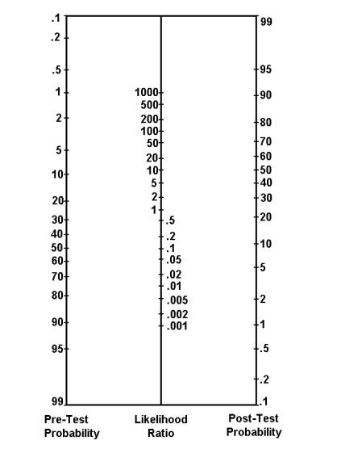
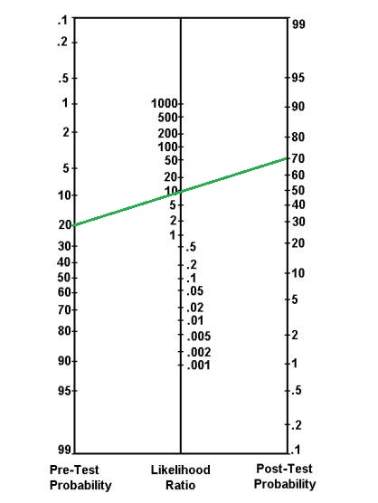
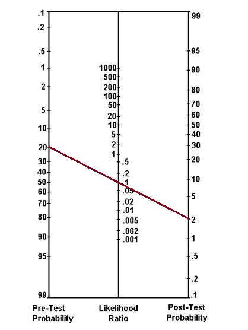

# 5. Fagans nomogram

::: info Ett grafiskt verktyg som dramatiskt förenklar användningen av sannolikhetsbaserad diagnostik. Nomogrammet kombinerar pretest probability, likelyhood ratio, och posttest probability.
:::

Syftet med detta nomogram är att den ska intuitivt illustrera komplicerade sannolikheter och hur dessa förändras. Man kan se nomogrammet som något form av stödhjul innan sannolikhetsbedömningarna sätter sig.

## Applicering

Låt säga du har en patient med ett pretest probability på 20% och du utför en undersökning med ett positivt likelyhood ratio på 10. Då får man en posttest probability på följande sätt:

Alltså har vi gått från 20% till 70% sannolikhet att patienten har sjukdomen. Något som är värt att ta i beaktning är att fundera över hur dramatiskt ett högt pretest probability förändrar undersökningens värde. Detta illustrerar bara hur viktigt det är med en gedigen anamnes och statustagning.

Låt nu säga vi har samma patient med PTP på 20% och du utför en undersökning med ett negativt likelyhood ratio på 0.1:

Patienten har då en minskad sannolikhet att han sjukdomen från 20% till 2%.